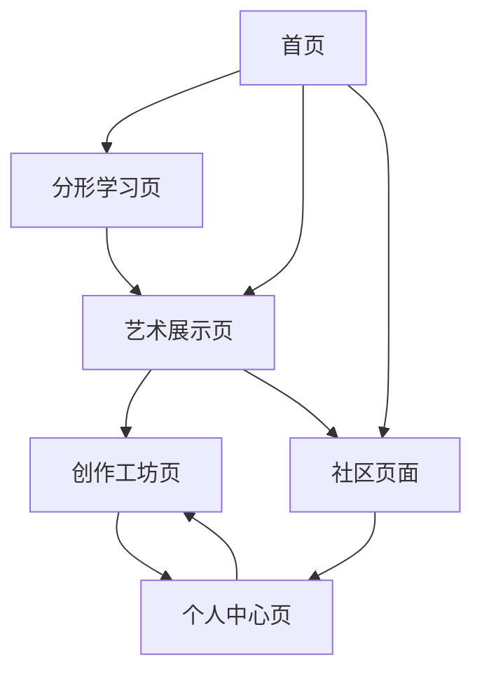

# 分形艺术展示平台 - 产品需求文档

## 1. Product Overview

分形艺术展示平台是一个基于WebGL技术的交互式教育平台，旨在通过实时渲染的分形图形和渐进式学习体验，让用户深入了解分形几何的数学美学和艺术价值。

- 解决问题：分形数学概念抽象难懂，缺乏直观的可视化学习工具，艺术爱好者难以接触到分形艺术的创作过程。
- 目标用户：数学爱好者、艺术创作者、教育工作者、对视觉艺术感兴趣的普通用户。
- 产品价值：通过交互式可视化降低分形学习门槛，推广分形艺术，培养用户对数学与艺术结合的兴趣。

## 2. Core Features

### 2.1 User Roles

| Role | Registration Method | Core Permissions |
|------|---------------------|------------------|
| 访客用户 | 无需注册 | 浏览所有分形展示、基础交互操作 |
| 注册用户 | 邮箱注册 | 保存个人作品、分享创作、参与社区讨论 |
| 创作者 | 邀请码升级 | 上传自定义shader、发布教程、获得创作收益 |

### 2.2 Feature Module

我们的分形艺术展示平台包含以下主要页面：

1. **首页**：分形艺术画廊、导航菜单、特色展示区域
2. **分形学习页**：分形概念介绍、交互式教程、渐进式学习路径
3. **艺术展示页**：各类分形作品展示、实时渲染效果、参数调节面板
4. **创作工坊页**：shader编辑器、参数调试工具、作品预览
5. **社区页面**：用户作品分享、讨论区、教程发布
6. **个人中心页**：作品管理、学习进度、个人设置

### 2.3 Page Details

| Page Name | Module Name | Feature description |
|-----------|-------------|---------------------|
| 首页 | 英雄区域 | 展示精选分形动画、平台介绍文案、开始探索按钮 |
| 首页 | 导航菜单 | 快速访问各功能模块、搜索功能、用户登录入口 |
| 首页 | 特色展示 | 轮播展示热门分形作品、用户评价、最新更新 |
| 分形学习页 | 概念介绍 | 分形定义、历史背景、数学原理的图文解释 |
| 分形学习页 | 交互教程 | 逐步引导用户理解分形生成过程、可操作的演示 |
| 分形学习页 | 学习路径 | 从简单到复杂的分形类型介绍、进度跟踪 |
| 艺术展示页 | 分形画廊 | Mandelbrot集、Julia集、分形树等多种类型展示 |
| 艺术展示页 | 实时渲染 | 高性能WebGL渲染、流畅的缩放和平移操作 |
| 艺术展示页 | 参数面板 | 实时调节迭代次数、颜色方案、缩放中心等参数 |
| 艺术展示页 | 动画控制 | 播放/暂停动画、调节动画速度、循环模式 |
| 创作工坊页 | Shader编辑器 | 代码高亮、语法检查、实时预览、模板库 |
| 创作工坊页 | 参数调试 | 可视化uniform变量调节、数值输入、滑块控制 |
| 创作工坊页 | 作品管理 | 保存/加载项目、导出图片/视频、分享功能 |
| 社区页面 | 作品展示 | 用户上传作品、点赞评论、分类筛选 |
| 社区页面 | 讨论区 | 技术交流、创作心得、问题求助 |
| 社区页面 | 教程发布 | 创作者发布教程、步骤说明、代码分享 |
| 个人中心页 | 作品管理 | 个人作品列表、编辑删除、隐私设置 |
| 个人中心页 | 学习进度 | 完成的教程、获得的成就、学习统计 |
| 个人中心页 | 账户设置 | 个人信息、通知偏好、账户安全 |

## 3. Core Process

**访客用户流程：**
用户进入首页 → 浏览分形艺术展示 → 进入学习页面了解分形概念 → 在艺术展示页体验交互操作 → 注册成为用户以保存喜欢的作品

**注册用户流程：**
登录账户 → 选择学习路径或直接创作 → 在创作工坊调试参数创建作品 → 保存并分享到社区 → 查看其他用户反馈

**创作者流程：**
上传自定义shader代码 → 创建详细教程 → 发布到社区供其他用户学习 → 获得用户反馈和收益

## 4. User Interface Design

### 4.1 Design Style

- **主色调**：深蓝色(#1a1a2e)和紫色(#16213e)渐变背景，体现科技感和神秘感
- **辅助色**：亮青色(#0f3460)用于强调，金色(#e94560)用于重要按钮
- **按钮样式**：圆角矩形按钮，带有微妙的发光效果和悬停动画
- **字体**：主标题使用现代无衬线字体(Inter/Roboto)，代码区域使用等宽字体(Fira Code)
- **布局风格**：卡片式布局，顶部导航栏，侧边参数面板，响应式网格系统
- **图标风格**：线性图标配合几何形状，体现数学和艺术的结合

### 4.2 Page Design Overview

| Page Name | Module Name | UI Elements |
|-----------|-------------|-------------|
| 首页 | 英雄区域 | 全屏分形动画背景，居中的标题和副标题，渐变色按钮，向下滚动指示器 |
| 首页 | 导航菜单 | 透明背景导航栏，logo左对齐，菜单项居中，登录按钮右对齐 |
| 首页 | 特色展示 | 3列网格布局，卡片式作品展示，悬停放大效果，底部分页器 |
| 分形学习页 | 概念介绍 | 左右分栏布局，左侧文字说明，右侧交互式图形演示 |
| 分形学习页 | 交互教程 | 步骤式引导界面，高亮提示框，进度条，下一步按钮 |
| 艺术展示页 | 分形画廊 | 全屏canvas渲染区域，半透明控制面板，浮动工具栏 |
| 艺术展示页 | 参数面板 | 右侧滑出面板，分组的滑块控件，颜色选择器，重置按钮 |
| 创作工坊页 | Shader编辑器 | 分屏布局，左侧代码编辑器，右侧实时预览，底部控制台 |
| 社区页面 | 作品展示 | 瀑布流布局，作品缩略图，作者信息，点赞数显示 |
| 个人中心页 | 作品管理 | 表格式列表，缩略图预览，操作按钮组，批量操作选择框 |

### 4.3 Responsiveness

平台采用桌面优先的响应式设计，针对大屏幕优化分形渲染效果。移动端适配包括触摸手势支持（双指缩放、拖拽平移）、简化的参数面板和折叠式导航菜单。平板设备支持横屏模式下的分屏操作界面。