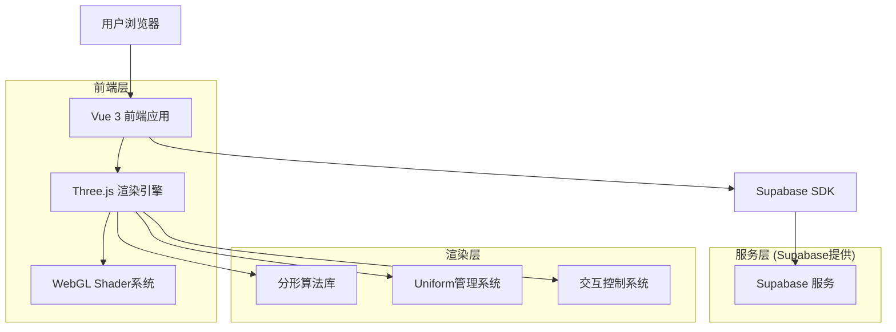
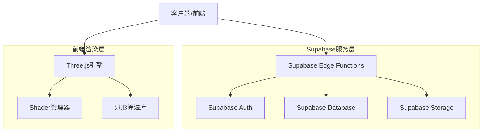
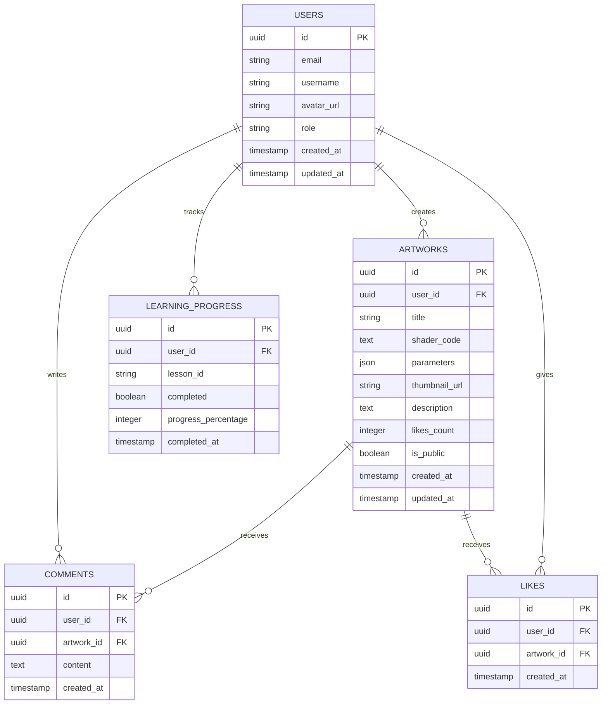

# 分形艺术展示平台 - 技术架构文档

## 1. Architecture design



## 2. Technology Description

* Frontend: Vue\@3 + TypeScript + Vite + TailwindCSS + Three.js + UnoCSS

* Backend: Supabase (Authentication + Database + Storage)

* Rendering: WebGL + GLSL Shaders + Three.js渲染引擎

## 3. Route definitions

| Route      | Purpose               |
| ---------- | --------------------- |
| /          | 首页，展示分形艺术画廊和平台介绍      |
| /learn     | 分形学习页面，提供概念介绍和交互教程    |
| /gallery   | 艺术展示页面，实时渲染各种分形效果     |
| /workshop  | 创作工坊，shader编辑器和参数调试工具 |
| /community | 社区页面，用户作品分享和讨论        |
| /profile   | 个人中心，作品管理和学习进度        |
| /login     | 用户登录页面                |
| /register  | 用户注册页面                |

## 4. API definitions

### 4.1 Core API

用户认证相关

```
POST /auth/v1/signup
```

Request:

| Param Name | Param Type | isRequired | Description |
| ---------- | ---------- | ---------- | ----------- |
| email      | string     | true       | 用户邮箱地址      |
| password   | string     | true       | 用户密码        |
| metadata   | object     | false      | 用户元数据       |

Response:

| Param Name | Param Type | Description |
| ---------- | ---------- | ----------- |
| user       | object     | 用户信息对象      |
| session    | object     | 会话信息        |

作品管理相关

```
POST /rest/v1/artworks
```

Request:

| Param Name     | Param Type | isRequired | Description |
| -------------- | ---------- | ---------- | ----------- |
| title          | string     | true       | 作品标题        |
| shader\_code   | string     | true       | Shader代码    |
| parameters     | json       | true       | 渲染参数        |
| thumbnail\_url | string     | false      | 缩略图URL      |
| description    | string     | false      | 作品描述        |

Response:

| Param Name  | Param Type | Description |
| ----------- | ---------- | ----------- |
| id          | uuid       | 作品唯一标识      |
| created\_at | timestamp  | 创建时间        |

Example

```json
{
  "title": "彩虹Mandelbrot集",
  "shader_code": "#ifdef GL_ES\nprecision mediump float;\n#endif...",
  "parameters": {
    "u_zoom": 1.5,
    "u_center": [0.0, 0.0],
    "u_maxIterations": 100,
    "u_colorScheme": 2
  },
  "description": "使用彩虹配色方案的Mandelbrot集合"
}
```

## 5. Server architecture diagram



## 6. Data model

### 6.1 Data model definition



### 6.2 Data Definition Language

用户表 (users)

```sql
-- 创建用户表
CREATE TABLE users (
    id UUID PRIMARY KEY DEFAULT gen_random_uuid(),
    email VARCHAR(255) UNIQUE NOT NULL,
    username VARCHAR(50) UNIQUE NOT NULL,
    avatar_url TEXT,
    role VARCHAR(20) DEFAULT 'user' CHECK (role IN ('user', 'creator', 'admin')),
    created_at TIMESTAMP WITH TIME ZONE DEFAULT NOW(),
    updated_at TIMESTAMP WITH TIME ZONE DEFAULT NOW()
);

-- 创建索引
CREATE INDEX idx_users_email ON users(email);
CREATE INDEX idx_users_username ON users(username);
```

作品表 (artworks)

```sql
-- 创建作品表
CREATE TABLE artworks (
    id UUID PRIMARY KEY DEFAULT gen_random_uuid(),
    user_id UUID REFERENCES users(id) ON DELETE CASCADE,
    title VARCHAR(200) NOT NULL,
    shader_code TEXT NOT NULL,
    parameters JSONB NOT NULL DEFAULT '{}',
    thumbnail_url TEXT,
    description TEXT,
    likes_count INTEGER DEFAULT 0,
    is_public BOOLEAN DEFAULT true,
    created_at TIMESTAMP WITH TIME ZONE DEFAULT NOW(),
    updated_at TIMESTAMP WITH TIME ZONE DEFAULT NOW()
);

-- 创建索引
CREATE INDEX idx_artworks_user_id ON artworks(user_id);
CREATE INDEX idx_artworks_created_at ON artworks(created_at DESC);
CREATE INDEX idx_artworks_likes_count ON artworks(likes_count DESC);
CREATE INDEX idx_artworks_is_public ON artworks(is_public);
```

评论表 (comments)

```sql
-- 创建评论表
CREATE TABLE comments (
    id UUID PRIMARY KEY DEFAULT gen_random_uuid(),
    user_id UUID REFERENCES users(id) ON DELETE CASCADE,
    artwork_id UUID REFERENCES artworks(id) ON DELETE CASCADE,
    content TEXT NOT NULL,
    created_at TIMESTAMP WITH TIME ZONE DEFAULT NOW()
);

-- 创建索引
CREATE INDEX idx_comments_artwork_id ON comments(artwork_id);
CREATE INDEX idx_comments_user_id ON comments(user_id);
CREATE INDEX idx_comments_created_at ON comments(created_at DESC);
```

学习进度表 (learning\_progress)

```sql
-- 创建学习进度表
CREATE TABLE learning_progress (
    id UUID PRIMARY KEY DEFAULT gen_random_uuid(),
    user_id UUID REFERENCES users(id) ON DELETE CASCADE,
    lesson_id VARCHAR(100) NOT NULL,
    completed BOOLEAN DEFAULT false,
    progress_percentage INTEGER DEFAULT 0 CHECK (progress_percentage >= 0 AND progress_percentage <= 100),
    completed_at TIMESTAMP WITH TIME ZONE,
    created_at TIMESTAMP WITH TIME ZONE DEFAULT NOW(),
    updated_at TIMESTAMP WITH TIME ZONE DEFAULT NOW(),
    UNIQUE(user_id, lesson_id)
);

-- 创建索引
CREATE INDEX idx_learning_progress_user_id ON learning_progress(user_id);
CREATE INDEX idx_learning_progress_lesson_id ON learning_progress(lesson_id);
```

点赞表 (likes)

```sql
-- 创建点赞表
CREATE TABLE likes (
    id UUID PRIMARY KEY DEFAULT gen_random_uuid(),
    user_id UUID REFERENCES users(id) ON DELETE CASCADE,
    artwork_id UUID REFERENCES artworks(id) ON DELETE CASCADE,
    created_at TIMESTAMP WITH TIME ZONE DEFAULT NOW(),
    UNIQUE(user_id, artwork_id)
);

-- 创建索引
CREATE INDEX idx_likes_user_id ON likes(user_id);
CREATE INDEX idx_likes_artwork_id ON likes(artwork_id);

-- 创建触发器更新作品点赞数
CREATE OR REPLACE FUNCTION update_artwork_likes_count()
RETURNS TRIGGER AS $$
BEGIN
    IF TG_OP = 'INSERT' THEN
        UPDATE artworks SET likes_count = likes_count + 1 WHERE id = NEW.artwork_id;
        RETURN NEW;
    ELSIF TG_OP = 'DELETE' THEN
        UPDATE artworks SET likes_count = likes_count - 1 WHERE id = OLD.artwork_id;
        RETURN OLD;
    END IF;
    RETURN NULL;
END;
$$ LANGUAGE plpgsql;

CREATE TRIGGER trigger_update_artwork_likes_count
    AFTER INSERT OR DELETE ON likes
    FOR EACH ROW EXECUTE FUNCTION update_artwork_likes_count();
```

权限设置

```sql
-- 为匿名用户授予基本读取权限
GRANT SELECT ON artworks TO anon;
GRANT SELECT ON users TO anon;
GRANT SELECT ON comments TO anon;

-- 为认证用户授予完整权限
GRANT ALL PRIVILEGES ON users TO authenticated;
GRANT ALL PRIVILEGES ON artworks TO authenticated;
GRANT ALL PRIVILEGES ON comments TO authenticated;
GRANT ALL PRIVILEGES ON learning_progress TO authenticated;
GRANT ALL PRIVILEGES ON likes TO authenticated;
```

初始化数据

```sql
-- 插入示例分形教程数据
INSERT INTO learning_progress (user_id, lesson_id, completed, progress_percentage) VALUES
('00000000-0000-0000-0000-000000000000', 'fractal_basics', false, 0),
('00000000-0000-0000-0000-000000000000', 'mandelbrot_intro', false, 0),
('00000000-0000-0000-0000-000000000000', 'julia_sets', false, 0),
('00000000-0000-0000-0000-000000000000', 'fractal_trees', false, 0);
```

